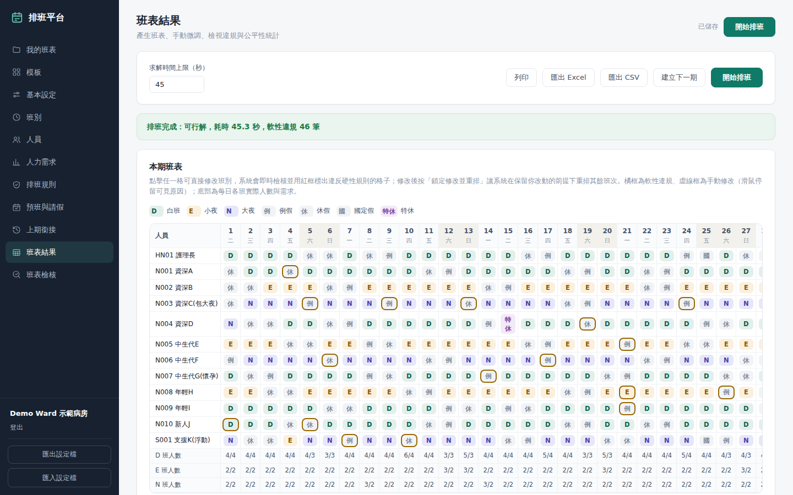
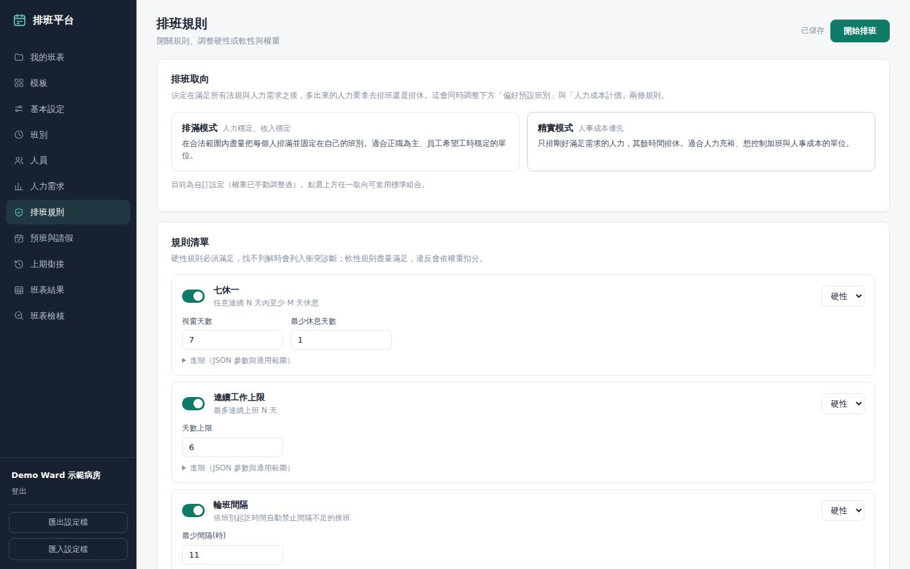
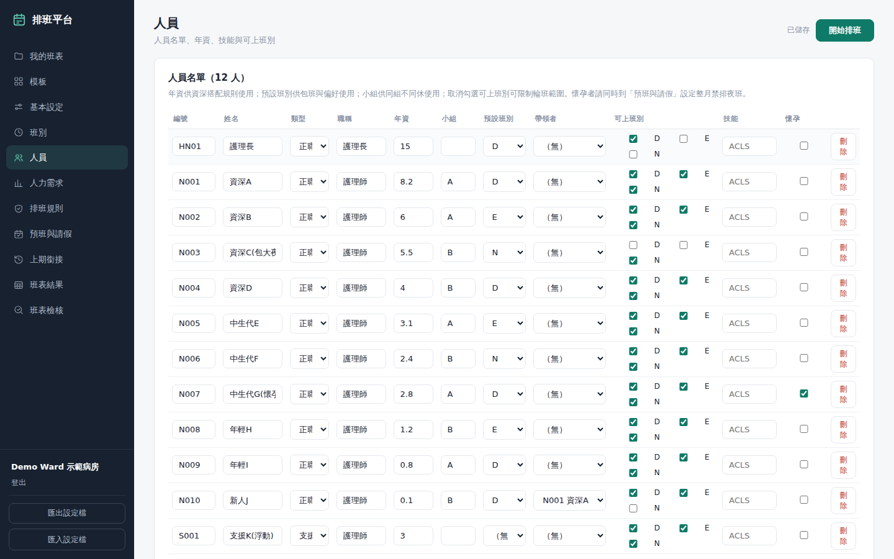

# Shiftly：模板化智慧排班平台

> English: [README_EN.md](README_EN.md)

選一個行業模板、依單位情況調整規則，系統就用 Google OR-Tools 的 CP-SAT 求解器
排出一份**符合台灣勞基法**的班表，並標示每一筆軟性取捨、每人工時與休假是否公平。
設計目標是讓護理長、店長這類非技術使用者，不必懂數學規劃也能自己排班。



## 解決什麼問題

排班的限制條件多且彼此衝突：七休一、兩班間隔 11 小時、四週變形工時、
每班資深人數、懷孕禁排夜班、夜班公平、個人預休……人工排一個 12 人病房的月班表
常要花上一整天，而且很難確認有沒有違法。

市面上的排班系統多半是「每個單位客製一套程式」。這個專案把規則拆成
**可組合的約束積木**，由 JSON 設定檔驅動：新單位只要選模板、改參數，不必改程式。

## 功能

- **7 個行業模板**：護理三班（月曆月／四週週期）、診所、工廠兩班制、保全 12 小時、餐飲、地勤
- **24 種約束積木**：法規（七休一、班距、工時上限、變形工時、加班上限、國定假日）、
  班型（連續班上限、禁止接班、包班）、公平與偏好（極差最小化、學姊帶新人、預設班別）、
  品質（避免單日休、週末休假）、進階（技能位分配、小組整組出勤）
- **每條規則可切換硬性／軟性**，軟性規則依權重扣分，結果頁逐筆列出取捨原因
- **無解時自動診斷**：逐一放寬單一條件試解，告訴使用者「放寬哪一條就排得出來」；
  人數根本不夠的情況由算術預檢在毫秒內回報缺多少人日
- **手動微調**：點格子改班別，即時以紅框標示違反的硬性規則；可鎖定修改後重排其餘部分
- **合規檢核器**：不求解，直接檢查任何一份既有班表（包括人工排的 Excel）違反了哪些規則
- **設定健檢**：抓出「不會導致無解、但會讓規則默默失效」的設定錯誤
- **跨月銜接**：帶入上期最後幾天，七休一與連續夜班不會在月初斷掉
- **排滿／精實兩種取向**：同一份工廠案例，精實模式總人力 −13.6%
- **匯出**：格式化 Excel（色塊、凍結窗格、統計表）、CSV、列印樣式
- **多使用者**：帳號、班表文件存伺服器、管理後台、線上備份

| 排班規則 | 人員設定 |
|---|---|
|  |  |

## 技術重點

### 規則積木化，而非寫死在程式裡

每條規則是一個獨立函式，接收設定檔中的參數並對 CP-SAT 模型加上約束；
同一種積木在不同模板用不同參數。例如「連續上班上限」與「七休一」共用同一個
滑動視窗實作，「兩班間隔 11 小時」則由班別的起訖時間**自動推導**出禁止的接班組合，
使用者改了班別時間，規則自動跟著變。

可執行的精簡示範見 [`engine-excerpt/toy_scheduler.py`](engine-excerpt/toy_scheduler.py)。

### 求解器與檢核器雙軌實作、互相驗證

建模器（把規則轉成約束）和檢核器（直接判斷班表是否違規）各自獨立實作同一套規則。
測試要求所有模板的求解結果都必須通過檢核、零違規，
任何一邊的語意飄移都會被抓到。

### 規模與效能

壓力測試（i5-12400F，31 天三班制）：

| 人數 | 首個合法班表 | 決策變數 | 記憶體 |
|---:|---:|---:|---:|
| 30 | 0.5 s | 6,546 | 118 MB |
| 188 | 3.5 s | 40,990 | 164 MB |
| 300 | 5.8 s | 65,406 | 194 MB |

模型規模隨人數線性成長，沒有組合爆炸；可行的最高人力利用率 70%，
理論上限 71%。

### 對外服務的安全性

後端（FastAPI + SQLite）在上線前做過一輪安全強化，原始碼公開於 [`backend/api/`](backend/api/)：

- 密碼以 scrypt 雜湊，登入限流，session cookie 設 HttpOnly / SameSite / Secure
- 預設密碼的帳號在**伺服器端**強制改密碼後才能使用其他 API（不只靠前端擋）
- 使用者提供的求解參數一律夾在伺服器上限內，每帳號同時只能有一個求解，避免資源耗盡
- 求解結果檢查擁有者、改密碼後其他 session 失效、備份快照送出後立即刪除

對應測試見 [`backend/tests/test_api_security.py`](backend/tests/test_api_security.py)。

## 架構

```
瀏覽器（vanilla JS SPA）
   │  JSON 設定檔（Schema v1）
   ▼
FastAPI ── 帳號 / 班表文件 / 背景求解工作 ── SQLite
   │
   ▼
排班引擎（未公開）
   預處理 → 算術預檢 → 約束積木建模 → CP-SAT 求解 → 軟違規回報 / 無解診斷
   合規檢核器、設定健檢
```

詳見 [design/architecture.md](design/architecture.md)。

**技術棧**：Python 3.11、Google OR-Tools CP-SAT、FastAPI、Pydantic v2、SQLite、
openpyxl、原生 JavaScript（無框架）、pytest（100 項測試）、Playwright。

## 公開範圍

這是作品集展示用的 repo，**不是完整產品**，無法直接架設成服務。

| 內容 | 狀態 |
|---|---|
| 前端（`frontend/`） | 公開 |
| API 層：認證、班表文件、背景工作、Excel 匯入匯出（`backend/api/`） | 公開 |
| 資料模型 Schema（`backend/engine/schema.py`） | 公開 |
| API 安全性測試（`backend/tests/`） | 公開 |
| 建模手法精簡示範（`engine-excerpt/`） | 公開，獨立可執行 |
| 約束積木實作、求解流程、無解診斷、檢核器、設定健檢、行業模板 | **未公開** |
| 引擎回歸測試（跨月、檢核交叉驗證、模板可解性等 86 項） | **未公開** |

## 著作權

© 2026 陳伯榕，保留所有權利。本 repo 僅供瀏覽與作品集展示，
未授權任何形式的複製、修改、散布或商業使用。詳見 [LICENSE](LICENSE)。
